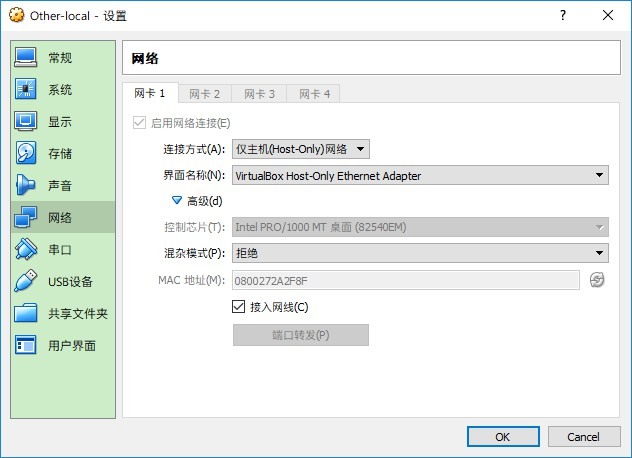

问题描述：

​	我的Win开发环境下已经在VirtualBox中安装4台虚拟机，因为换了工位,IP网段的变化使得之前配置的Kafka集群等一些测试环境出现异常,在恢复的过程中虽然之前也有一些笔记记录，但太过零散，查看起来还是不方便，随成此文。

​	在构建虚拟机测试环境时，总是尽可能让虚拟机向真机靠拢(特指网络上的位置)。就会出现“怎样让虚拟机像宿主机一样能被同局域网的其他主机访问？”这样的问题.

为了使宿主机能够被局域网中的其他主机访问，链接方式上使用的是**仅主机(Host-Only)网络** 。



界面名称选择的是虚拟出来的网卡,在实现与宿主机“同起同坐”的目标前提 也会使我们的虚拟机能够访问网络，虚拟出来的网卡并不能上网，毕竟我们的宿主机只是普通的PC，我知道两种解决方法：

1、配置宿主机的原始网卡属性->共享 允许其他网络用户通过此计算机的Internet连接来连接的方式实现，会使IP编程固定的192.168.137.X什么的,想要更换PC默认分配的这个网段 需要修改注册表什么的来实现。重点用第2种

2、原理是一样的都是讲网络共享，只是这里是将虚拟网卡与宿主机的网卡进行桥接(这好像变成了我们不在虚拟机上配置桥接什么的转化到了宿主机上),很简单的操作类似Ctrl选中两个文件一样 ,右键配置桥接

为实现“虚拟机能够被宿主机所在的局域网中的其他主机访问”的目的，所需外部的条件都已经配置好了。剩下的就是Linux中网络的配置.

1、IP地址分配在 /etc/sysconfig/network-scripts/ifcfg-enp0s3

	​```config
	DEVICE=enp0s3
	BOOTPROTO=static
	ONBOOT=yes
	
	IPADDR=192.168.0.X
	NETMASK=255.255.255.0
	​```

2、网关地址可以独立分配在 /etc/sysconfig/network中
   ```config
GATEWAY=192.168.0.1
   ```

3、DNS地址单独分配在 /etc/resolv.conf
   ```config
nameserver 192.168.0.1
   ```

> Tips: win环境下配置本机网路适配器采用网桥（桥接）的方式

#### VBox安装增强工具

在设备选择安装增强功能时，可能会出现会出现这种情况
 

默认时挂载在 /dev/cdrom下，这时到 /dev/cdrom下，并未获取到有效信息，由与一些我不知道的机制，导致这样。使用mount命令 进行挂载点的转移
```config
mount -t auto /dev/cdrom /mnt/cdrom
```
可以再 /mnt/cdrom下看到 VBoxLinuxAdditions.run 运行，可能会出现错误信息，缺少某些依赖（kernel-handers kernel-devel,bzip2,gcc等），直接更新 kernel-devel kernel-headers会产生版本的差异会出现以下错误，提示内核模块尚未构建
```config
this system is currently not set up to build kernel modules
```
可以通过
```config
yum install "kernel-devel-$(uname -r)" 
```
的方式安装相匹配版本

当然也可以通过使用
```config
rpm -qa kernel* | sort -V | tail -n 5
```
查看相关版本，使用
```config
yum -y upgrade kernel kernel-devel kernel-tools
```
将版本调整一致 记得关于kernel的操作要reboot才能生效
再执行
```config
./VBoxLinuxadditions
```
配置完成以后 可以通过
```
mount -t vboxsf pcshare /mnt/share
```
挂载共享文件夹
参考资料;
[安装VirtualBox Additional依赖](https://www.cnblogs.com/weilu2/p/virtualbox_host_w7_guest_centos7.html)
[ISO挂载错误处理](https://github.com/bocai-h/my_blog/wiki/Centos7-virtualbox%E8%99%9A%E6%8B%9F%E6%9C%BA%E5%A2%9E%E5%BC%BA%E5%8A%9F%E8%83%BD%E5%AE%89%E8%A3%85)